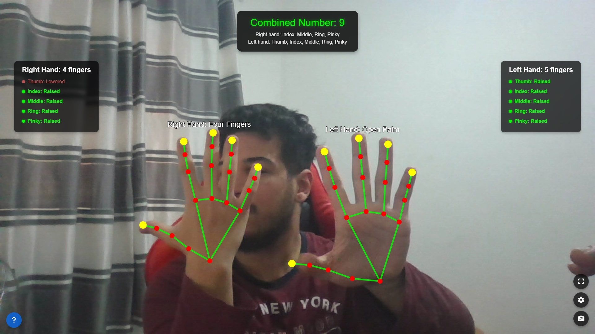

# Hand Gesture Recognition and Finger Counter

<div align="center">
  
  
  
  
  
  
</div>

<div align="center">
  <h3>Real-time finger counting and hand gesture recognition using MediaPipe</h3>
  <p>Developed by <a href="https://github.com/terminaldz">@terminaldz</a></p>
</div>

## 📷 Preview



## ✨ Features

- **Real-time hand detection** using MediaPipe Hands
- **Finger counting** for both left and right hands
- **Combined finger number** from both hands
- **Gesture recognition** (peace sign, thumbs up, pointing, etc.)
- **Customizable settings** through an intuitive UI panel
- **Performance monitoring** with debug mode
- Fully **responsive design** that works on desktop and mobile
- **Camera flip functionality** to switch between front and rear cameras
- **Fullscreen mode** for immersive experience

## 🚀 Quick Start

### Online Demo

Try the live demo: [Hand Gesture Recognition Demo](https://terminaldz.github.io/hand-gesture-recognition)

### Run Locally

1. Clone the repository:
```bash
git clone https://github.com/terminaldz/hand-gesture-recognition.git
```

2. Navigate to the project directory:
```bash
cd hand-gesture-recognition
```

3. Open `index.html` in your browser or use a local server:
```bash
# Using Python's built-in server
python -m http.server
```

4. Open your browser and navigate to `http://localhost:8000`

## 🛠️ Technical Details

### Technologies Used

- **MediaPipe Hands**: For hand and finger tracking
- **HTML5 Canvas**: For drawing hand landmarks and visual feedback
- **JavaScript**: For application logic and gesture detection
- **CSS3**: For styling and animations
- **Bootstrap 5**: For responsive layout and UI components
- **jQuery**: For DOM manipulation

### Implementation Highlights

- **Object-Oriented Design**: The application uses classes for better organization and maintainability
- **Adjustable Detection Parameters**: Fine-tune model performance through the settings panel
- **Optimized Rendering**: Efficient canvas rendering for smooth performance
- **Cross-browser Compatibility**: Works across modern browsers
- **Mobile-First Approach**: Designed to work well on both desktop and mobile devices

## ⚙️ Settings and Configuration

The application provides a settings panel where you can adjust:

- **Detection Confidence**: Threshold for hand detection accuracy
- **Tracking Confidence**: Threshold for hand tracking between frames
- **Model Complexity**: Balance between accuracy and performance
- **Debug Mode**: Display performance statistics and tracking data
- **Show Landmarks**: Toggle visibility of hand landmark points

## 🌟 Gesture Recognition

The application can recognize the following gestures:

- **Fist/Closed Hand**: No fingers raised
- **Pointing Up**: Only index finger raised
- **Peace Sign**: Index and middle fingers raised
- **Thumbs Up**: Only thumb raised
- **Open Palm**: All fingers raised
- **Three Fingers**: Index, middle, and ring fingers raised
- **Four Fingers**: All fingers raised except thumb

## 🌐 Browser Support

- Chrome 83+
- Firefox 76+
- Safari 13+
- Edge 83+
- Opera 69+

## 📱 Mobile Support

The application is optimized for mobile browsers with:

- Responsive UI that adapts to screen size
- Camera flip functionality for front/rear cameras
- Touch-friendly controls

## 📚 Keyboard Shortcuts

- **D**: Toggle debug mode
- **F**: Toggle fullscreen
- **ESC**: Close settings panel

## 🔍 Future Improvements

- [ ] Add more complex gesture recognition
- [ ] Implement hand gesture-based controls for web applications
- [ ] Save user preferences to local storage
- [ ] Add support for multiple language interfaces
- [ ] Create pre-defined gesture libraries for common uses


## 🤝 Contributing

Contributions, issues, and feature requests are welcome! Feel free to check the [issues page](https://github.com/terminaldz/hand-gesture-recognition/issues).

## 💬 Contact

- GitHub: [@terminaldz](https://github.com/terminaldz)

---

<div align="center">
  <p>If you found this project interesting, please consider giving it a ⭐️!</p>
</div>